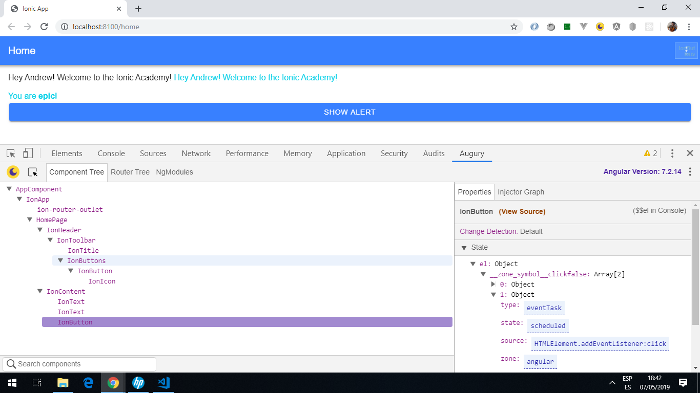
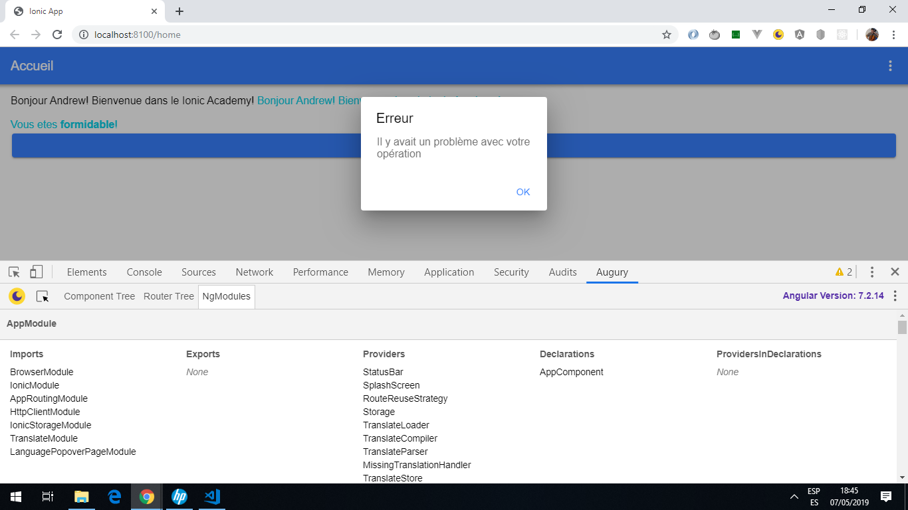
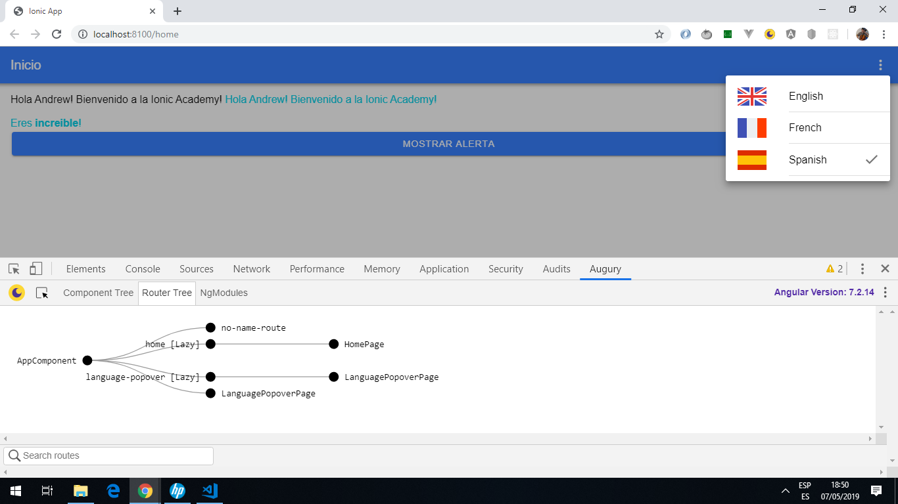

# :zap: Ionic Angular Localiser

* This project uses [ngx translate, the internationalisation (i18n) library for Angular](http://www.ngx-translate.com) to change the content of the home page and alert button to the language chosen.
* **Note:** to open web links in a new window use: _ctrl+click on link_


## :page_facing_up: Table of contents

* [:zap: Ionic Angular Localiser](#zap-ionic-angular-localiser)
  * [:page_facing_up: Table of contents](#page_facing_up-table-of-contents)
  * [:books: General info](#books-general-info)
  * [:camera: Screenshots](#camera-screenshots)
  * [:signal_strength: Technologies](#signal_strength-technologies)
  * [:floppy_disk: Setup](#floppy_disk-setup)
  * [:computer: Code Examples](#computer-code-examples)
  * [:cool: Features](#cool-features)
  * [:clipboard: Status & To-Do List](#clipboard-status--to-do-list)
  * [:clap: Inspiration](#clap-inspiration)
  * [:file_folder: License](#file_folder-license)
  * [:envelope: Contact](#envelope-contact)

## :books: General info

* "The [ngx-translate, the internationalisation (i18n) library for Angular](http://www.ngx-translate.com) lets you define translations for your content in different languages and switch between them easily.
* It allows access to a service, a directive and a pipe to handle any dynamic or static content. The main part of the library is the 'core'. A loader was added to load translations into the app.

## :camera: Screenshots





## :signal_strength: Technologies

* [Ionic framework v6](https://ionicframework.com/)
* [Angular framework v13](https://angular.io/)
* [ngx translate/core (i18n) library v13](http://www.ngx-translate.com)
* [Angular Augery Chrome Extension v1](https://augury.rangle.io/) useful for debugging.

## :floppy_disk: Setup

* Run `npm i` to install dependencies
* Run `ng lint` to lint files - all files currently pass linting.
* Run `ng serve` for a dev server. Navigate to `http://localhost:4200/`. The app will automatically reload if you change any of the source files.

## :computer: Code Examples

* `language.service.ts` function to set app language using option selected by user.

```typescript
// sets default language as browser language if no other language choice made
// if language language selected then this value is stored using the ionic storage module
setInitialAppLanguage() {
  const language = this.translate.getBrowserLang();
  this.translate.setDefaultLang('en');

  this.storage.get(LNG_KEY).then(val => {
    if (val) {
      this.setLanguage(val);
      this.selected = val;
    }
  });
}
```

## :cool: Features

* Select a language from the drop-down list and the language of headers, buttons, text alerts (as set up in the `/assets/i18n/json` files will change.

## :clipboard: Status & To-Do List

* Status: Working
* To-Do: Nothing

## :clap: Inspiration

* [Ionic Academy: How to Localise Your Ionic App with ngx-translate](https://ionicacademy.com/localise-ionic-ngx-translate/).

## :file_folder: License

* This project is licensed under the terms of the MIT license.

## :envelope: Contact

* Repo created by [ABateman](https://github.com/AndrewJBateman), email: gomezbateman@yahoo.com
